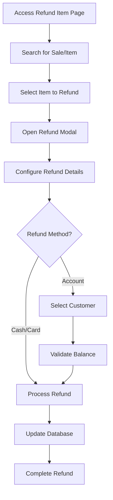
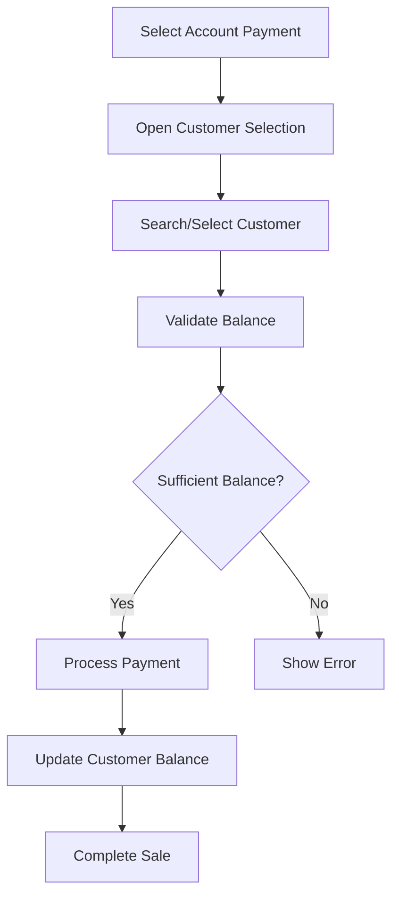

# Refund Item System - KQS POS

## Overview

The Refund Item system allows cashiers to process refunds for individual items from previous sales. This system supports multiple refund methods including cash, card, and account credit, with full database integration and customer account management.

## Features

### 🔍 Search & Discovery
- **Receipt Number Search**: Find sales by transaction number
- **Style/Code Search**: Find items by product name or SKU
- **Date-based Filtering**: Separate today's sales from historical sales
- **Real-time Results**: Instant search results with item counts

### 💰 Refund Methods
- **Cash Refund**: Direct cash payment to customer
- **Card Refund**: Refund to original payment method
- **Account Credit**: Credit customer account for future purchases

### 👥 Customer Account Management
- **Balance Checking**: Automatic verification of customer account balances
- **Credit Limits**: Respect customer credit limits
- **Account History**: Track all account transactions
- **Balance Updates**: Automatic balance updates after refunds

### 🛡️ Security & Validation
- **Branch Isolation**: Users can only access data from their assigned branches
- **Balance Validation**: Prevents refunds exceeding available balances
- **Audit Trail**: Complete tracking of all refund transactions
- **User Authentication**: All actions tied to authenticated users

## Database Schema

### Core Tables

#### `refunds`
```sql
CREATE TABLE refunds (
    id UUID PRIMARY KEY,
    original_sale_id UUID REFERENCES sales(id),
    refund_number VARCHAR(50) UNIQUE,
    customer_id UUID REFERENCES customers(id),
    refund_amount DECIMAL(10,2),
    refund_method VARCHAR(50), -- cash, card, account
    reason VARCHAR(255),
    status VARCHAR(20), -- pending, completed, rejected
    processed_by UUID,
    processed_at TIMESTAMP,
    branch_id UUID REFERENCES branches(id),
    created_at TIMESTAMP,
    updated_at TIMESTAMP
);
```

#### `refund_items`
```sql
CREATE TABLE refund_items (
    id UUID PRIMARY KEY,
    refund_id UUID REFERENCES refunds(id),
    original_sale_item_id UUID REFERENCES sale_items(id),
    product_id UUID REFERENCES products(id),
    variant_id UUID REFERENCES product_variants(id),
    quantity INTEGER,
    unit_price DECIMAL(10,2),
    refund_amount DECIMAL(10,2),
    reason VARCHAR(255),
    created_at TIMESTAMP
);
```

#### `customers` (Enhanced)
```sql
ALTER TABLE customers ADD COLUMN current_balance DECIMAL(10,2) DEFAULT 0;
ALTER TABLE customers ADD COLUMN credit_limit DECIMAL(10,2) DEFAULT 0;
ALTER TABLE customers ADD COLUMN status VARCHAR(20) DEFAULT 'active';
ALTER TABLE customers ADD COLUMN branch_id UUID REFERENCES branches(id);
```

## User Interface

### Refund Item Page (`/pos/refunds/item`)

#### Search Interface
- **Toggle Search Type**: Switch between receipt number and style/code search
- **Search Input**: Real-time filtering with placeholder text
- **Results Counter**: Shows number of items found

#### Item Display
- **Product Information**: Name, SKU, quantity, pricing
- **Sale Details**: Receipt number, customer, date, payment method
- **Status Indicators**: Visual badges for refunded/available items
- **Action Buttons**: Process refund for available items

#### Refund Modal
- **Item Details**: Complete product and sale information
- **Refund Configuration**: Amount, method, reason selection
- **Customer Selection**: For account credit refunds
- **Validation**: Real-time error checking and feedback
- **Summary**: Complete refund overview before processing

### Account Payment Integration

#### Payment Method Selection
- **Account Option**: Available in POS payment methods
- **Customer Selection**: Modal for choosing account customer
- **Balance Display**: Real-time balance and limit information
- **Validation**: Prevents purchases exceeding available balance

#### Customer Selection Modal
- **Search Functionality**: Find customers by name, email, or phone
- **Balance Status**: Visual indicators for account status
- **Sufficiency Check**: Automatic validation of purchase amounts
- **Branch Filtering**: Only shows customers from current branch

## Workflow

### 1. Refund Item Process



### 2. Account Payment Process



## API Integration

### Refund Processing

```typescript
// Process refund with account credit
const handleProcessRefund = async (
  itemId: string, 
  refundAmount: number, 
  reason: string, 
  refundMethod: string, 
  customerId?: string
) => {
  // 1. Create refund record
  const { data: refund } = await supabase
    .from('refunds')
    .insert({
      original_sale_id: item.saleId,
      refund_number: `REF-${Date.now()}`,
      customer_id: customerId,
      refund_amount: refundAmount,
      refund_method: refundMethod,
      reason: reason,
      status: 'completed',
      processed_by: user?.id,
      branch_id: selectedBranch?.id
    })

  // 2. Create refund item record
  await supabase
    .from('refund_items')
    .insert({
      refund_id: refund.id,
      original_sale_item_id: itemId,
      product_id: item.productId,
      quantity: item.quantity,
      unit_price: item.unitPrice,
      refund_amount: refundAmount,
      reason: reason
    })

  // 3. Update customer balance for account refunds
  if (refundMethod === 'account' && customerId) {
    await supabase
      .from('customers')
      .update({ 
        current_balance: supabase.raw(`current_balance + ${refundAmount}`)
      })
      .eq('id', customerId)
  }
}
```

### Account Payment Processing

```typescript
// Process account payment
const handlePayment = async () => {
  // 1. Validate account customer
  if (selectedPaymentMethod === 'account' && !accountCustomer) {
    throw new Error('Please select a customer for account payment')
  }

  // 2. Check balance sufficiency
  if (accountCustomer.current_balance < finalTotal) {
    throw new Error(`Insufficient balance. Available: ${formatCurrency(accountCustomer.current_balance)}`)
  }

  // 3. Create sale record
  const { data: sale } = await supabase
    .from('sales')
    .insert({
      transaction_number: `SALE-${Date.now()}`,
      customer_id: accountCustomer.id,
      total_amount: finalTotal,
      payment_method: 'account',
      sale_type: 'credit',
      branch_id: selectedBranch?.id
    })

  // 4. Update customer balance
  await supabase
    .from('customers')
    .update({ 
      current_balance: supabase.raw(`current_balance - ${finalTotal}`)
    })
    .eq('id', accountCustomer.id)
}
```

## Security Features

### Row Level Security (RLS)
- **Branch Isolation**: Users can only access data from their assigned branches
- **User Authentication**: All operations require authenticated users
- **Data Validation**: Server-side validation of all inputs

### Access Control
```sql
-- Refunds policies
CREATE POLICY "Users can view refunds for their branches" ON refunds
    FOR SELECT USING (
        branch_id IN (
            SELECT branch_id FROM user_branch_assignments 
            WHERE user_id = auth.uid()
        )
    );
```

## Error Handling

### Common Error Scenarios
1. **Insufficient Balance**: Customer doesn't have enough account balance
2. **Item Already Refunded**: Attempting to refund an already refunded item
3. **Invalid Amount**: Refund amount exceeds original sale amount
4. **Network Issues**: Connection problems during processing
5. **Permission Denied**: User doesn't have access to branch data

### Error Recovery
- **Automatic Retry**: Network errors trigger automatic retry
- **User Feedback**: Clear error messages with actionable advice
- **State Preservation**: Form data preserved during errors
- **Rollback Support**: Database transactions ensure data consistency

## Performance Optimizations

### Database Indexes
```sql
-- Refunds indexes
CREATE INDEX idx_refunds_original_sale_id ON refunds(original_sale_id);
CREATE INDEX idx_refunds_customer_id ON refunds(customer_id);
CREATE INDEX idx_refunds_branch_id ON refunds(branch_id);
CREATE INDEX idx_refunds_status ON refunds(status);

-- Customer indexes
CREATE INDEX idx_customers_branch_id ON customers(branch_id);
CREATE INDEX idx_customers_current_balance ON customers(current_balance);
```

### Query Optimization
- **Efficient Joins**: Optimized queries for sales and items
- **Pagination**: Large result sets handled with pagination
- **Caching**: Frequently accessed data cached appropriately
- **Lazy Loading**: Customer data loaded only when needed

## Testing

### Manual Testing Checklist
- [ ] Search by receipt number works correctly
- [ ] Search by style/code returns expected results
- [ ] Today's sales vs other sales filtering works
- [ ] Refund modal opens with correct item data
- [ ] Refund amount validation prevents over-refunding
- [ ] Account payment requires customer selection
- [ ] Balance validation prevents insufficient payments
- [ ] Database records are created correctly
- [ ] Customer balances update properly
- [ ] Error messages display appropriately
- [ ] Branch isolation works correctly

### Automated Testing
```typescript
// Example test for refund processing
describe('Refund Processing', () => {
  it('should process cash refund correctly', async () => {
    const refundData = {
      itemId: 'test-item-id',
      refundAmount: 50.00,
      reason: 'Customer Request',
      refundMethod: 'cash'
    }
    
    const result = await processRefund(refundData)
    expect(result.success).toBe(true)
    expect(result.refund.status).toBe('completed')
  })

  it('should validate account balance', async () => {
    const customer = { id: 'test-customer', current_balance: 25.00 }
    const refundAmount = 50.00
    
    expect(() => validateAccountBalance(customer, refundAmount))
      .toThrow('Insufficient balance')
  })
})
```

## Deployment

### Database Migration
1. Run the `refund-system-migration.sql` script
2. Verify all tables and columns exist
3. Check RLS policies are in place
4. Test with sample data

### Environment Variables
```env
# Required for refund system
NEXT_PUBLIC_SUPABASE_URL=your_supabase_url
NEXT_PUBLIC_SUPABASE_ANON_KEY=your_supabase_anon_key
SUPABASE_SERVICE_ROLE_KEY=your_service_role_key
```

### Configuration
- **Payment Methods**: Enable account payment in admin settings
- **Branch Assignment**: Ensure users are assigned to branches
- **Customer Data**: Import or create customer accounts with balances

## Troubleshooting

### Common Issues

#### "No customers found" error
- Check if customers exist in the current branch
- Verify customer status is 'active'
- Ensure user has access to branch data

#### "Insufficient balance" error
- Verify customer account balance is correct
- Check if recent transactions have been processed
- Review customer credit limit settings

#### Refund not appearing in list
- Check if item was already refunded
- Verify sale belongs to current branch
- Ensure user has proper permissions

#### Database connection errors
- Check Supabase connection settings
- Verify RLS policies are configured correctly
- Review network connectivity

### Debug Mode
Enable debug logging by setting:
```typescript
const DEBUG_MODE = process.env.NODE_ENV === 'development'
```

## Support

For technical support or questions about the refund system:
1. Check this documentation
2. Review the database migration logs
3. Test with sample data
4. Contact the development team

## Future Enhancements

### Planned Features
- **Bulk Refunds**: Process multiple items at once
- **Partial Refunds**: Refund specific quantities of items
- **Exchange Processing**: Handle item exchanges
- **Refund Analytics**: Reporting and insights
- **Email Notifications**: Automatic customer notifications
- **Receipt Generation**: Print refund receipts

### Integration Opportunities
- **Inventory Management**: Automatic stock adjustments
- **Loyalty System**: Points adjustments for refunds
- **Accounting Integration**: Export to accounting systems
- **Customer Portal**: Self-service refund requests
